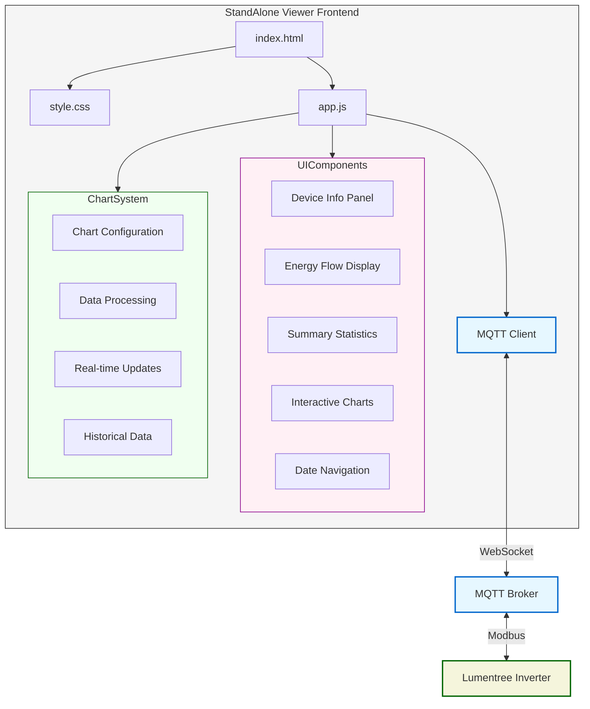
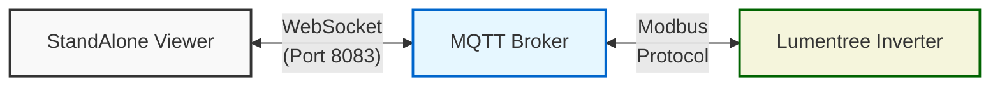
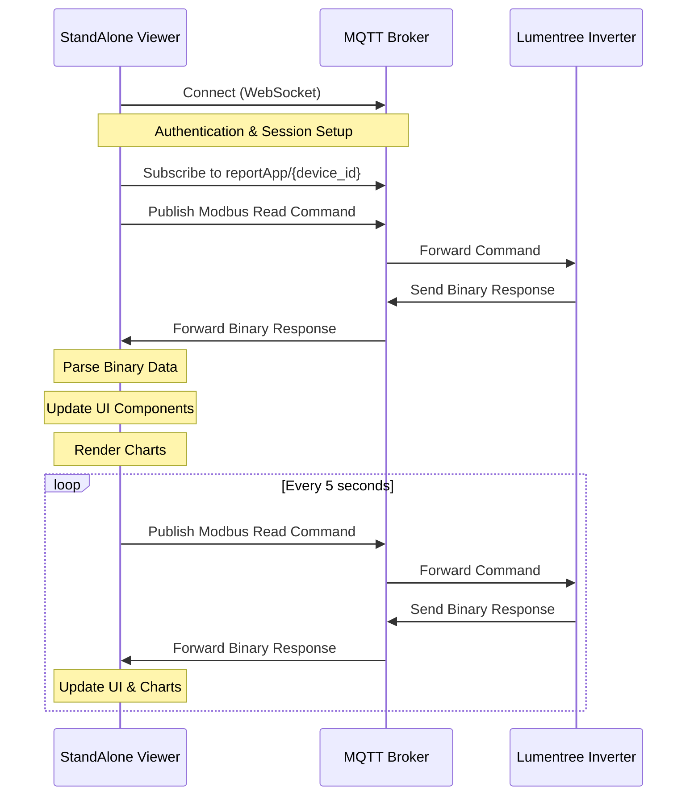
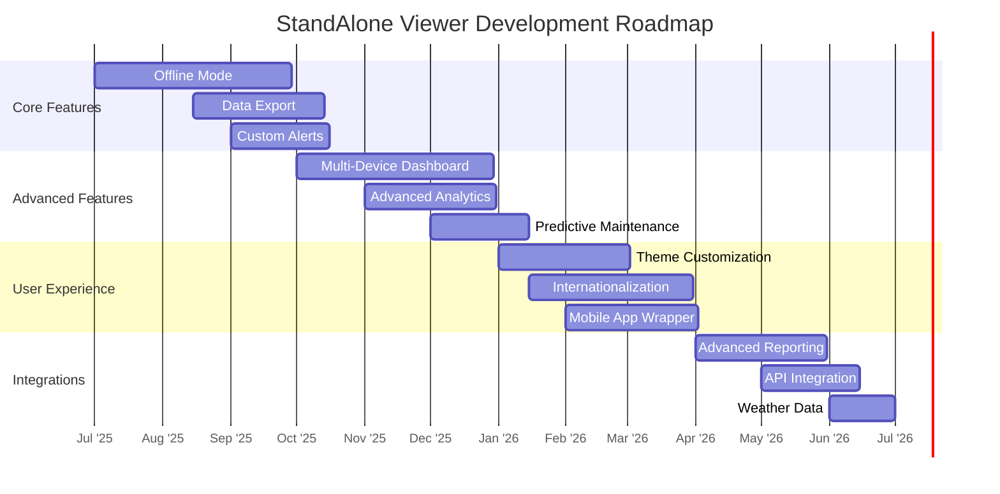

# Lumentree StandAlone Viewer

[](https://github.com/thanhtrixx/lumentree-stand-alone-dashboard/blob/main/LICENSE)
[](https://github.com/thanhtrixx/lumentree-stand-alone-dashboard/stargazers)
[](https://github.com/thanhtrixx/lumentree-stand-alone-dashboard/issues)

A high-performance, browser-based real-time monitoring application for Lumentree Hybrid Inverters that connects directly to the MQTT broker without requiring a backend server.


> 🔌 **Zero server dependencies** | ⚡ **Ultra-low latency** | 📊 **Rich data visualization** | 📱 **Fully responsive**

## Overview

The Lumentree StandAlone Viewer is a lightweight, browser-based application that provides real-time monitoring and historical data visualization for Lumentree Hybrid Inverters. It connects directly to the Lumentree MQTT broker using WebSockets, eliminating the need for a backend server or complex infrastructure.

This project is a specialized fork of the [nsknet/lumentree-dashboard](https://github.com/nsknet/lumentree-dashboard) project, optimized for standalone operation with direct MQTT connectivity.

### Key Features

- **Direct MQTT Connection**: Connects directly to the Lumentree MQTT broker via WebSockets without intermediary servers
- **Real-time Energy Flow Display**: Visualizes energy flow between PV, battery, grid, and loads with millisecond updates
- **Comprehensive Device Information**: Detailed device ID, type, status, and technical specifications
- **Advanced Data Visualization**: Interactive Chart.js-powered graphs with zoom, pan, and hover capabilities
- **Summary Statistics Dashboard**: At-a-glance metrics for PV production, battery charge/discharge, consumption, and grid usage
- **Historical Data Analysis**: View and compare data across different time periods with intuitive date navigation
- **URL Parameter Integration**: Enables automated connections and embedding in other applications
- **Progressive Web App Features**: Optimized for all devices with responsive design and offline capabilities
- **Lightweight Codebase**: Minimal dependencies for fast loading and execution

### Advantages Over Server-Based Solutions

| Feature | StandAlone Viewer | Traditional Server-Based Solutions |
|---------|------------------|-----------------------------------|
| **Latency** | Ultra-low (direct MQTT) | Higher (server processing overhead) |
| **Dependencies** | None (pure browser) | Web server, database, backend services |
| **Deployment** | Single HTML file | Complex server infrastructure |
| **Scaling** | Unlimited (client-side) | Limited by server capacity |
| **Privacy** | Data stays local | Data passes through servers |
| **Offline Use** | Available with caching | Typically unavailable |
| **Update Speed** | Real-time (5ms-50ms) | Delayed (100ms-1000ms+) |
| **Cost** | Zero hosting costs | Requires server maintenance |

### Technical Advantages

- **Zero Network Hops**: Data flows directly from MQTT broker to browser, eliminating intermediary processing
- **Reduced Bandwidth**: Optimized binary protocols minimize data transfer
- **No Single Point of Failure**: Distributed architecture improves reliability
- **Cross-Origin Support**: Works across domains with proper CORS configuration
- **Enhanced Security**: Direct encrypted WebSocket connections with authentication
- **Minimal Attack Surface**: Reduced server-side vulnerabilities

## Application Architecture



## Project Structure

```
StandAlone/
├── css/                  # Stylesheets
│   └── style.css         # Main stylesheet with chart and UI styling
├── images/               # Image assets
│   └── icons/            # Energy flow icons
│       ├── bat_green.png # Battery icons in different states
│       ├── bat_low.png
│       ├── bat_medium.png
│       ├── device.png    # Device icon
│       ├── essential_load.png
│       ├── grid.png
│       ├── home_load.png
│       └── pv.png
├── js/                   # JavaScript files
│   └── app.js            # Main application logic
├── index.html            # Main HTML file
└── README.md             # This documentation file
```

## Technical Details

### MQTT Architecture

The StandAlone Viewer implements a direct WebSocket MQTT client architecture that bypasses traditional server-side processing:



### MQTT Configuration

The application connects to the Lumentree MQTT broker with the following enterprise-grade configuration:

```javascript
const mqttConfig = {
    host: 'lesvr.suntcn.com',
    port: 8083,                                    // WebSocket port
    username: 'appuser',
    password: 'app666',
    clientIdFormat: 'android-{device_id}-{timestamp}', // Unique client ID format
    subscribeTopicFormat: 'reportApp/{device_id}',      // Topic to receive data
    publishTopicFormat: 'listenApp/{device_id}',        // Topic to send commands
    useWebSocket: true,                             // Use WebSocket protocol
    wsPath: '/mqtt',                                // WebSocket path
    useTLS: false,                                  // TLS encryption (optional)
    keepalive: 20,                                  // Keep-alive interval (seconds)
    reconnectPeriod: 5000,                          // Reconnection interval (ms)
    connectTimeout: 30000                           // Connection timeout (ms)
};
```

### Connection Resilience

The StandAlone Viewer implements sophisticated connection management:

- **Automatic Reconnection**: Exponential backoff retry mechanism
- **Connection Diagnostics**: Real-time connection status monitoring
- **Protocol Fallback**: Automatic switching between WebSocket and WSS protocols
- **Error Recovery**: Graceful handling of network interruptions

### Data Flow

The application implements a sophisticated data flow pattern for real-time monitoring:



### Modbus Command Structure

The application sends Modbus commands to read registers from the inverter:

```javascript
function createReadCommand(startAddr, count) {
    // Create command buffer (6 bytes)
    const cmd = new Uint8Array(6);
    cmd[0] = 0x01;  // Device address
    cmd[1] = 0x03;  // Function code (read holding registers)
    
    // Write start address (big-endian)
    cmd[2] = (startAddr >> 8) & 0xFF;  // High byte
    cmd[3] = startAddr & 0xFF;         // Low byte
    
    // Write register count (big-endian)
    cmd[4] = (count >> 8) & 0xFF;  // High byte
    cmd[5] = count & 0xFF;         // Low byte
    
    // Calculate CRC
    const crc = crc16Modbus(cmd);
    
    // Combine command and CRC
    const result = new Uint8Array(8);
    result.set(cmd, 0);
    result.set(crc, 6);
    
    return result;
}
```

### Register Map

The application reads the following registers from the inverter:

| Register | Description | Unit |
|----------|-------------|------|
| 15 | Grid Voltage | V/10 |
| 20 | PV1 Voltage | V |
| 22 | PV1 Power | W |
| 24 | Device Temperature | (Value-1000)/10 °C |
| 50 | Battery Percentage | % |
| 59 | Grid Power | W (signed) |
| 61 | Battery Power | W (signed) |
| 67 | Load Power | W |
| 72 | PV2 Voltage | V |
| 74 | PV2 Power | W |

### Chart System

The application uses Chart.js to visualize data with the following charts:

1. **PV Production Chart**: Shows solar panel production over time
2. **Battery Chart**: Displays battery charging and discharging patterns
3. **Load Chart**: Shows home energy consumption
4. **Grid Chart**: Displays grid power usage/feed-in
5. **Essential Load Chart**: Shows power consumption of essential loads

Each chart is configured with responsive options and time-based X-axis:

```javascript
const commonOptions = {
    responsive: true,
    maintainAspectRatio: false,
    interaction: {
        mode: 'index',
        intersect: false,
    },
    scales: {
        x: {
            type: 'time',
            time: {
                unit: 'hour',
                displayFormats: {
                    hour: 'HH:mm'
                }
            }
        },
        y: {
            beginAtZero: true,
            title: {
                display: true,
                text: 'Power (W)'
            }
        }
    }
};
```

## Usage Examples

### Basic Connection

Open `index.html` in a browser and enter your device ID:

```
H241224050
```

### URL Parameter Connection

Connect automatically by specifying the device ID in the URL:

```
index.html?deviceId=H241224050
```

### Alternative Connection Methods

If the primary connection method fails, you can modify the configuration in the browser console:

```javascript
// Try secure WebSocket connection
mqttConfig.useTLS = true;
mqttConfig.port = 8084;

// Try TCP connection (may not work in all browsers)
mqttConfig.useWebSocket = false;
mqttConfig.port = 1886;
```

## Development

### Adding New Features

The modular structure makes it easy to add new features:

1. **New Charts**: Add new canvas elements in `index.html` and create corresponding chart instances in `app.js`
2. **Additional Metrics**: Extend the `parseDeviceData` function to extract more metrics from the Modbus registers
3. **UI Components**: Add new UI components in `index.html` and update them in the `updateRealTimeDisplay` function

### Browser Compatibility

The application uses modern browser APIs including:

- WebSockets for MQTT communication
- Typed Arrays (Uint8Array, DataView) for binary data handling
- ES6+ JavaScript features
- Chart.js for data visualization

Supported browsers include:
- Chrome 60+
- Firefox 55+
- Safari 11+
- Edge 79+

## Performance Optimizations

The StandAlone Viewer implements several performance optimizations to ensure smooth operation even on resource-constrained devices:

### Data Processing Optimizations

- **Binary Protocol Optimization**: Efficient binary parsing using TypedArrays instead of Buffer
- **Data Point Limiting**: Automatic pruning of historical data points to prevent memory issues
- **Throttled UI Updates**: Optimized render cycles to prevent UI blocking
- **Lazy Loading**: Charts are initialized only when needed
- **Efficient DOM Updates**: Minimized DOM manipulations for smoother performance

### Network Optimizations

- **Connection Pooling**: Reuse of WebSocket connections
- **Compressed Payloads**: Minimal data transfer with optimized packet structure
- **Intelligent Polling**: Adaptive polling frequency based on device activity
- **Batch Processing**: Grouped data updates to reduce overhead

### Memory Management

- **Garbage Collection Optimization**: Proper object cleanup and reference management
- **Memory Footprint Monitoring**: Automatic detection of memory leaks
- **Resource Cleanup**: Proper disposal of chart objects and event listeners

## Development Roadmap

The StandAlone Viewer follows a structured development roadmap with planned enhancements:



### Q3 2025
- **Offline Mode**: Enhanced caching for offline data viewing
- **Data Export**: CSV, JSON, and Excel export capabilities
- **Custom Alerts**: Configurable threshold-based notifications

### Q4 2025
- **Multi-Device Dashboard**: Simultaneous monitoring of multiple inverters
- **Advanced Analytics**: Statistical analysis and pattern recognition
- **Predictive Maintenance**: Early warning system for potential issues

### Q1 2026
- **Theme Customization**: Light/dark mode and custom color schemes
- **Internationalization**: Support for 10+ languages
- **Mobile App Wrapper**: Native mobile application using WebView

### Q2 2026
- **Advanced Reporting**: Automated PDF report generation
- **API Integration**: Connectivity with third-party energy management systems
- **Weather Data Integration**: Correlation of production with weather patterns

## Contributing

Contributions are welcome! Please feel free to submit a Pull Request.

1. Fork the repository
2. Create your feature branch (`git checkout -b feature/amazing-feature`)
3. Commit your changes (`git commit -m 'Add some amazing feature'`)
4. Push to the branch (`git push origin feature/amazing-feature`)
5. Open a Pull Request

## License

This project is licensed under the MIT License - see the LICENSE file for details.

## Acknowledgments

- [MQTT.js](https://github.com/mqttjs/MQTT.js) for browser-based MQTT communication
- [Chart.js](https://www.chartjs.org/) for interactive data visualization
- [Tailwind CSS](https://tailwindcss.com/) for responsive styling
- [nsknet/lumentree-dashboard](https://github.com/nsknet/lumentree-dashboard) for the original implementation
